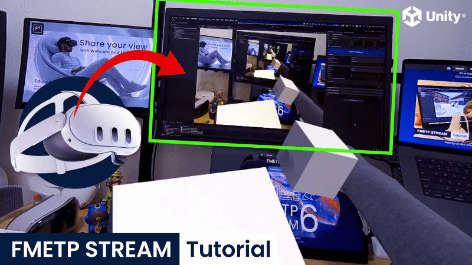
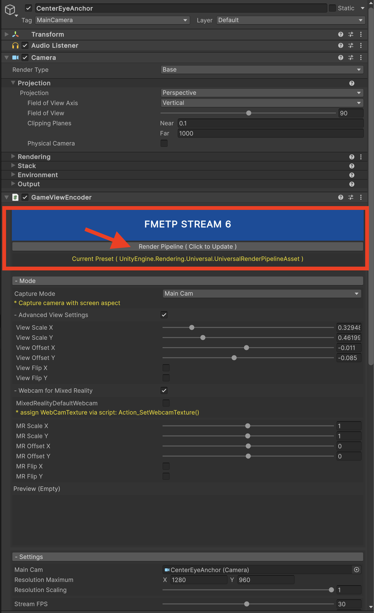
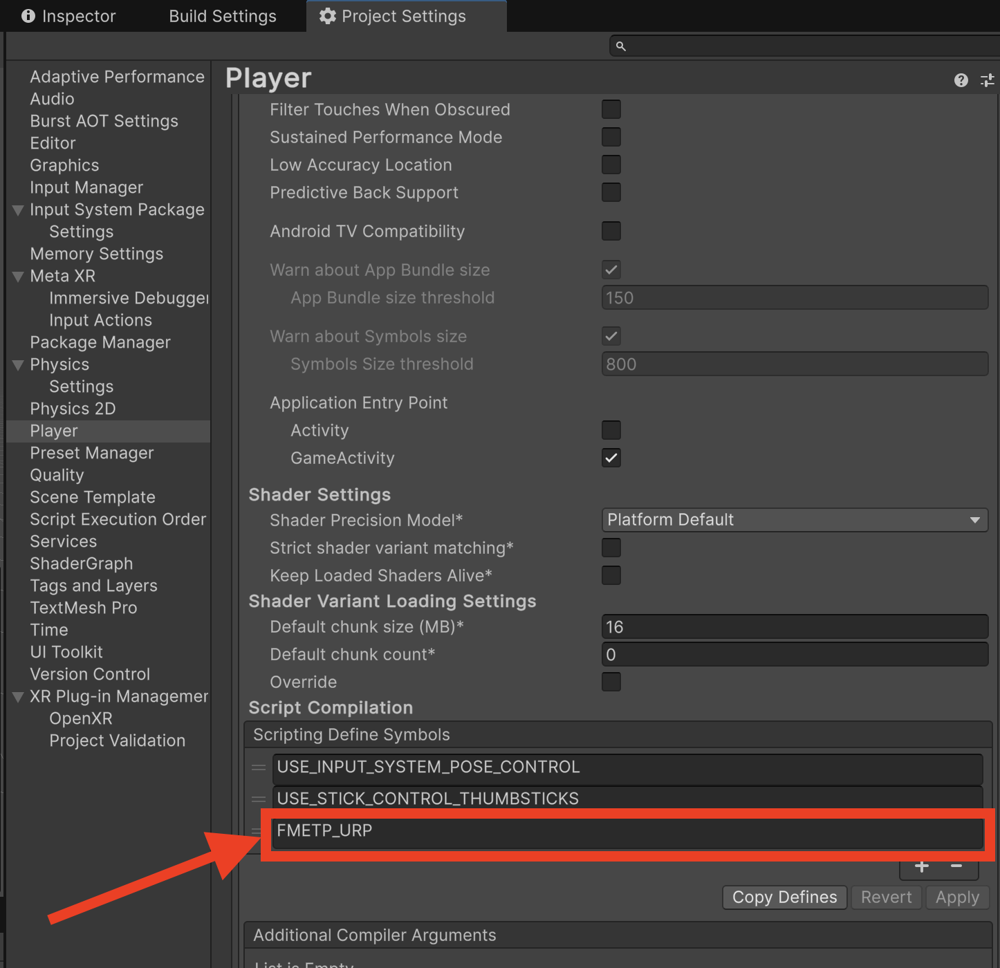

# other examples
- remote desktop example >>
https://github.com/frozenmistadventure/fmetp_tutorial_questvr_stream

# fmetp_tutorial_questvr_passthrough
This example project demonstrates the low latency passthrough live stream (In-Game camera + webcam access) to any platforms, via **FMETP STREAM 6**.
- supports: Android | iOS | Mac | PC | Linux | HoloLens 2 | Vision Pro | WebGL | StereoPi | and more
- Youtube Tutorial:
https://youtu.be/vJNRrGsxT-k

- Tested with Unity 2022.3.58f1 and 6000.0.61f1
- Asset Store link: https://assetstore.unity.com/packages/slug/307623
- Support: thelghome@gmail.com

 

# Live Stream Meta Quest Mixed Reality to any devices
For quick testing:
- Download this template and import FMETP STREAM 6(v6.120 or above)
- Build & Deploy the scene "QuestVR_PassthroughCameraStreamer(UDP)_HardwareAcceleration" or "QuestVR_PassthroughCameraStreamer(UDP)_Software" to Quest3/3S
- The viewer scene is "QuestVR_PassthroughCameraReceiver(UDP)"

Minor notes:
- both hardware acceleration and software encode are both supported.
- software(libvpx) is highly optimised with more control in quality, latency, cpu usage. In some cases, it could perform better than hardware acceleration if you assign more threads(cpu).
- hardware acceleration(mediacodec ndk) should reduce cpu load in general, with minimal control in quality and latency.
- The latest FMETP STREAM 6.060 or above supports real-time streaming codec VP8, VP9 and AV1.

|   Low Latency   | Cross Platforms |   Build & Run   |
|:---------------:|:---------------:|:---------------:|
|  |  |  |

Troubleshootings (Gree Image, or White Image)
- if the stream is White image, better check the FMNetworkManager connection status.
For FMNetwork example scene, sometimes Unity Editor will occupy the UDP socket ports. Thus, please don't running multiple Unity Editor with the same UDP ports.

- if the stream is Green image in URP

|   Auto Check URP/BIRP   | URP with "FMETP_URP" |
|:---------------:|:---------------:|
|  |  |

# Reference
This example project refer to official oculus samples. For further setup requirement, please refer to this repo
- https://github.com/oculus-samples/Unity-PassthroughCameraApiSamples
